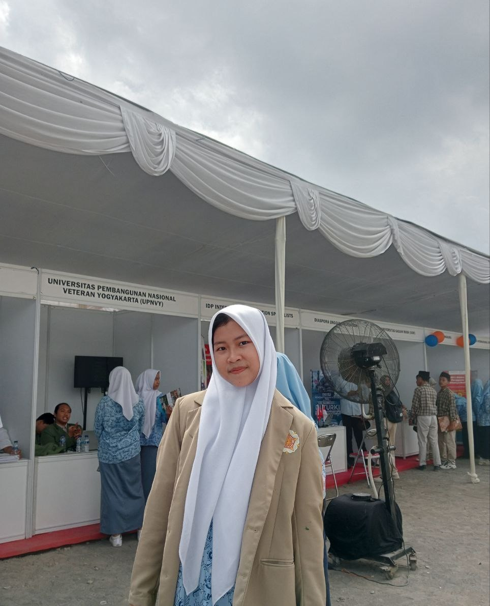

# 👋 Hi, I’m ummu syakhshiyah 🌸
  ## about me 
- ## Feel free to call me Ushi ✨
- 👔 I’m currently in high shcool
- 💞️ I’m looking to collaborate on ...
- 📫 How to look at me in: syakhshiyahshi@gmail.com, {instragram}
  (https://www.instagram.com/shi34n_/), {telegram} (https://web.telegram.org/k/)
- 😄 Beginner acount
- ⚡ My plan: to be able to create a website that is very safe and secure so that the business or project can run well.
-  🏝 im live : in riau
 # ✨✨✨✨✨✨
 ## Education

#### 1. [MTS HIDYATUL MUBTADIIN AS SIAKII DAYUN]  | Dayun `2021-2024`
- as treasurer of the student council ([HMD](https://www.instagram.com/mts_himada//))
  
#### 2. [SMA SAINS AL-QURAN ](https://www.instagram.com/smasainsalquran/) | Yogyakarta `2025-now`
---
- 👸🏻My hobby :cooking, reading, and opening social media
- 🧚🏼‍♀My ideals :health based business
- #### Dream university: [Universitas Gadjah Mada](https://ugm.ac.id/id) | next..
  #✨✨have participated in the Quran recitation competition and science olympiad
  
</head>
<body>
  <h1>view</h1>

  

<!---
U5hi/U5hi is a ✨ special ✨ repository because its `README.md` (this file) appears on your GitHub profile.
You can click the Preview link to take a look at your changes.
--->
